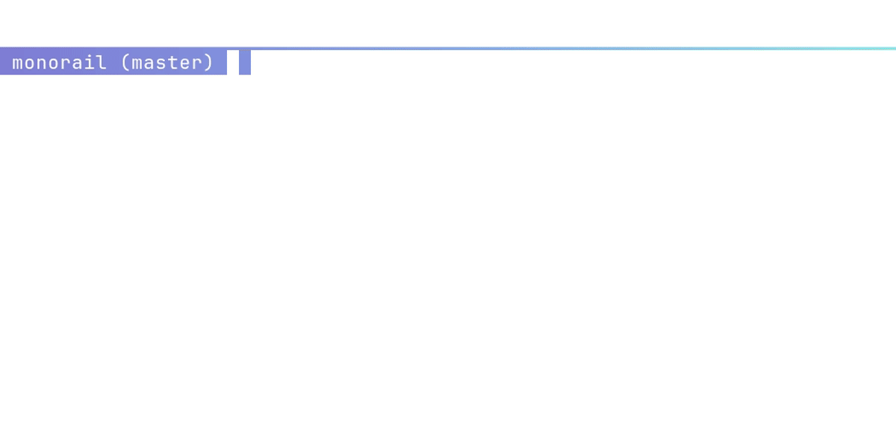
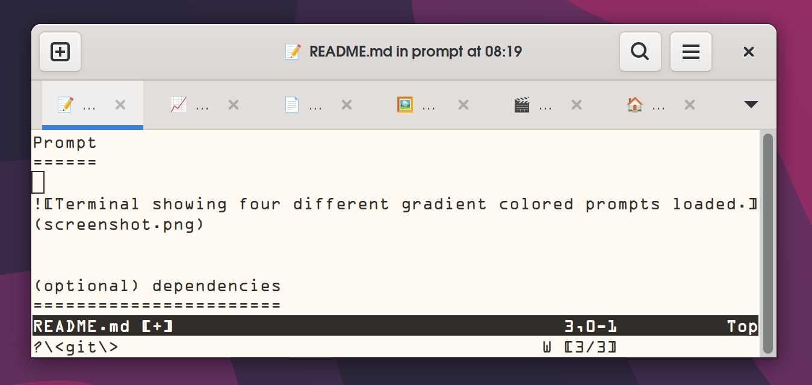
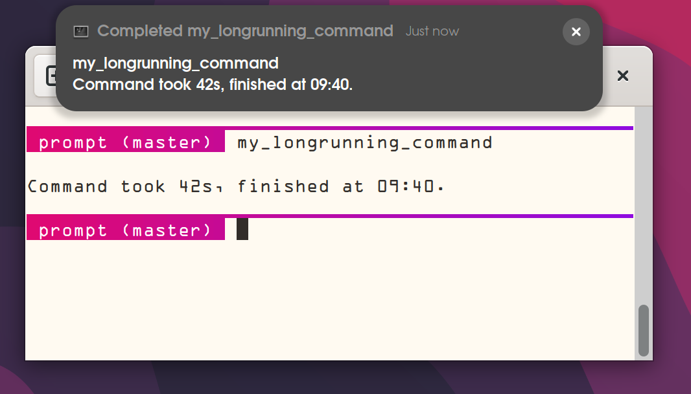

🚝 Monorail Prompt
==================

Monorail is a simple and beautiful shell prompt with customizable gradient colors.



Features
--------
* Fast start-up and rendering of prompt.
* Horizontal gradient "monorail" line across the terminal.
* Menu to select pre-computed gradients and command to compute gradient LUTs.
* Favicon like title icons for commands and folders
* Magic-shellball when Enter is pressed multiple times

Installation
------------

```
mkdir -p ~/.local/share
cd ~/.local/share
git clone --recursive https://github.com/arnognulf/monorail

```

Add the following line to ~/.bashrc or ~/.zshrc

```
. ~/.local/share/monorail/monorail.sh
```

Open a new terminal for changes to take effect.

Changing colors
---------------
Run `monorail_color` to change background
```
monorail_color fffaf1
```

Run `monorail_fgcolor` to change foreground
```
monorail_fgcolor 444444
```

Run `monorail_gradient` to change prompt gradient:
```
monorail_gradient  0 b1e874  100 00d4ff
```
The `gradient` command has a simple syntax which gives an easy translation of gradients from https://cssgradient.io/ and https://uigradients.com.

Run `monorail_gradienttext` to change prompt gradient text:
```
monorail_gradienttext  0 ffffff  100 444444
```


Favicon titles
--------------


Use an emoji in the title as a favicon so the context of the terminal tab can be easily visualized even if the full text is not shown.


Different folders have their own icons, being in a git folder shows the construction icon for instance.

Timing statistics
-----------------

By default, commands are measured and will emit a popup notification and audible beep if they take longer than 30 seconds.


This is useful for starting a long-running task, and then reading up on another subject, or drinking a coffee until the computer notifies that the task is complete.




Defining icons, statistics, and priorities
------------------------------------------

To configure app icons, and wether to emit a notification or not, we need to define what "kind" of category a command is:

* interactive command - reponsive to user input, no notification when ended.
* batch command - user input is either not possible or not frequent, can be long-running and thus a notification is needed when ending.

Interactive commands
--------------------
This is a type of command that should be responsive for user input.


Interactive commands should have a high priority in order for the system to appear responsive to the user.


It is of little interest how long such a command has been running since often the user themselves stops the command.

* no measurement of running time.
* no notification when exiting.
* high priority, important for a responsive system.
* examples: text editors, media players, and debuggers.


Declaring an interactive process:

```
interactive_command 📝 vim
```

Batch commands
--------------
This is a command that consumes lots of CPU resources.


A batch command is run with low priority since it would otherwise make the system unresponsive.


* measurement of time is important, so artifacts can be used for next task.
* notification so user can focus on other task until batch process is complete.
* low priority, user interactivity is more important than a batch process.
* examples: compilation tools, encoding of video, and text search utilities such as grep and find.


Declaring a batch command:

```
batch_command ⚒️  make
```

Predefined list of commands
---------------------------
For simplicity, a default list of commands and icons are defined in default_commands.sh.


The commands can be overridden by re-defining them in ~/.bashrc or ~/.zshrc


Supported shells
----------------
Tested on bash 5.2 and zsh 5.9

Supported terminals
-------------------
Monorail gradients are drawn with the truecolor escape codes which are supported on most modern terminals.


See https://github.com/termstandard/colors for a comprehensive list of supported terminal status.


Notably, macOS Terminal prior to macOS 26 Tahoe does not support truecolor.

Contributing themes
-------------------
Avoid trademarks and names of organizations (political and apolitical).


I do not wish to infringe trademarks, nor do I want to endorse organizations that may turn supervillan the next day.


Also, please keep gradients look-up-tables at up to 200 elements to conserve space (unless a really good reason exists).

Credits
-------
Oklab: A perceptual color space for image processing: https://bottosson.github.io/posts/oklab/


How to calculate color contrast: https://www.leserlich.info/werkzeuge/kontrastrechner/index-en.php


`bc(1)` helper functions: http://phodd.net/gnu-bc/code/logic.bc


bash-preexec which enables timing statistics: https://github.com/rcaloras/bash-preexec


StackExchange discussion on how to differentiate if user pressed ENTER or entered a command: https://unix.stackexchange.com/questions/226909/tell-if-last-command-was-empty-in-prompt-command


ghosh uiGradients for the large collection of beautiful uiGradients that many monorail themes are based upon: https://github.com/ghosh/uiGradients


