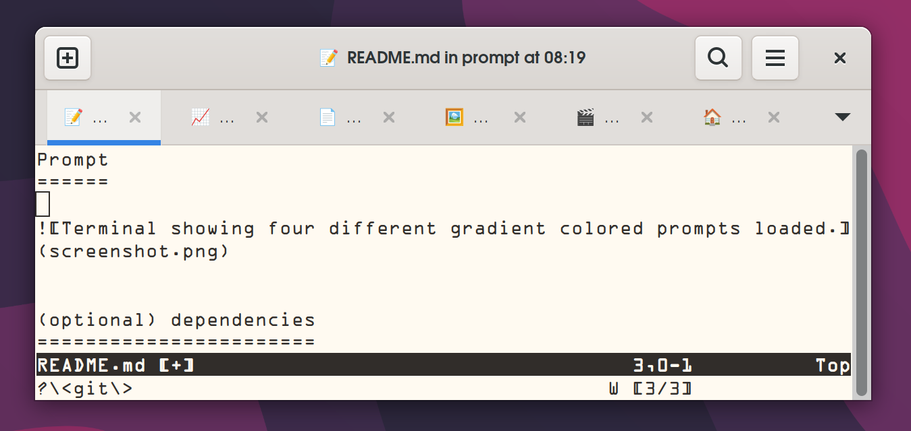
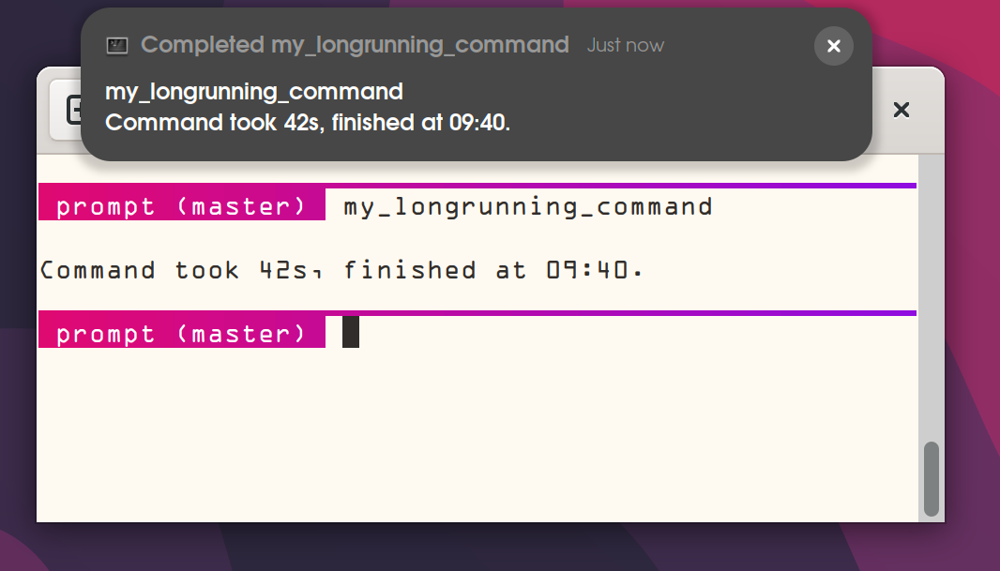
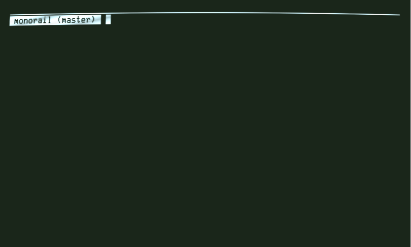

🚝 Monorail Prompt
==================

Monorail is a simple and beautiful shell prompt for Bash, Zsh, Fish, and Posix shells with customizable gradient colors.


Features
--------
* Fast start-up and rendering of prompt.
* Horizontal gradient "monorail" line across the terminal.
* Theme selector of pre-computed gradients and images.
* Gradient creator command with similar syntax to css gradients.
* Favicon like title icons for commands and folders
* Falls back to compat version for non-bash/zsh shells and terminals lacking truecolor support.

Installation
============
Common
------
The following dependencies are recommended but not required:
`bc`, `xxd`, `fzf`, and `ImageMagick`

On Debian and Ubuntu based systems, these can be installed with

`sudo apt install bc xxd fzf imagemagick`

Add monorail to your prompt by running the following:

```
mkdir -p ~/.local/share
cd ~/.local/share
git clone https://github.com/arnognulf/monorail
```
(if not using git, download zip from https://github.com/arnognulf/monorail/archive/refs/heads/master.zip)

Bash / Zsh
----------
For bash and zsh, add the following line to ~/.bashrc or ~/.zshrc

```
. ~/.local/share/monorail/monorail.sh
```

Open a new terminal for changes to take effect.

Fish
----
Create the ~/.config/fish/conf.d directory:
```
mkdir -p ~/.config/fish/conf.d/
```
Add the following to ~/.config/fish/conf.d/load_monorail.fish
```
source ~/.local/share/monorail/monorail.fish
```
Open a new terminal for changes to take effect.

Posix sh and Ksh
----------------
Add the following to ~/.profile
```
ENV="$HOME"/.shrc
export ENV
```
Add the following to ~/.shrc
```
. ~/.local/share/monorail/monorail.compat.sh
```

Log out and log in for changes to take effect.

Yash
----
Add the following to ~/.yashrc
```
. ~/.local/share/monorail/monorail.compat.sh
```
Open a new terminal for changes to take effect.

Brush
-----
Remove any previous calls to `$HOME/.local/share/monorail/monorail.sh` from `~/.bashrc`.

Add the following lines to `~/.bashrc`:
```
if [[ $BRUSH_VERSION ]];then
. $HOME/.local/share/monorail/monorail.compat.sh
else
. $HOME/.local/share/monorail/monorail.sh
fi
```
Open a new terminal for changes to take effect.

Usage
=====
Change gradient
---------------
`monorail_gradient` without arguments brings up an fzf selection of pre-computed gradients.

Run `monorail_gradient` to compute a custom prompt gradient:
```
monorail_gradient b1e874 1  00d4ff 100
```
The `gradient` command has a simple syntax which gives an easy translation of gradients from https://cssgradient.io/ and https://uigradients.com.

Arguments come in pairs, multiple pairs may be specified.
Each pair has a percentage (1-100) and a color value in hex, eg:

```
monorail_gradient b1e874 1  c324f5 30  00d4ff 100
```

There is also a CSS like rgb helper to translate rgb colors to hex:

```
monorail_gradient  $(rgb 231,67,42) 1  $(rgb 29,67,85) 42  $(rgb 16,57,163) 100
```


Run `monorail_textgradient` to change prompt gradient text:
```
monorail_textgradient  ffffff 1  444444 100
```


Set image as gradient
---------------------
Use `monorail_image` with an image as argument to set the image as gradient.

`monorail_image` without arguments brings up an fzf selection of images to use as prompt "background".

Changing colors
---------------
Monorail comes with color scheme setting from the iTerm2 color scheme project: https://github.com/mbadolato/iTerm2-Color-Schemes

*Note: many terminals do not support color setting despite colors showing up in the preview. This is not a bug in monorail*

Run `monorail_color` to change foreground
```
monorail_color fffaf1
```

Run `monorail_color` with a second color parameter to change background as well
```
monorail_color 00cc44 000000
```

To specify RGB colors, use the rgb() function as follows:
```
monorail_color  $(rgb 231,67,42) $(rgb 16,00,163) 
```

`monorail_color` without arguments brings up an fzf selection of colors.


Favicon titles
==============


Use an emoji in the title as a favicon so the context of the terminal tab can be easily visualized even if the full text is not shown.


Different folders have their own icons, being in a git folder shows the construction icon for instance.


Favicons are not enabled for monorail compat (ksh) since emoji fonts and clor rendering on emojis are not very common on simpler window managers.

Timing statistics
=================

By default, commands are measured and will emit a popup notification and audible beep as well as terminal bell if they take longer than 30 seconds.


This is useful for starting a long-running task, and then reading up on another subject, or drinking a coffee until the computer notifies that the task is complete.




Defining icons, statistics, and priorities
------------------------------------------

To configure app icons, and wether to emit a notification or not, we need to define what category of category a command is:

* interactive command - reponsive to user input, no notification when ended.
* batch command - user input is either not possible or not frequent, can be long-running and thus a notification is needed when ending.

Interactive commands
--------------------
Interactive commands are commands that should be responsive for user input or run with low latency.


These commands should run with high priority so they respond quickly to user requests or play sounds without interrupts.


Timing statistics will not be collected for interactive commands since the exit is not dependent on runtime but rather user initiated exit.


* no measurement of running time.
* no notification when exiting.
* high priority, important for a responsive system.
* examples: text editors, media players, and debuggers.


Declaring an interactive process:

```
interactive_command 📝 vim
```

Batch commands
--------------
Batch commands are commands that consumes lots of CPU resources and are not sensitive to latency.


These commands should run with low priority so they don't interfere with interactive commands that needs low latency.


* measurement of time is important for statistics and troubleshooting.
* notification so user can focus on other task until batch process is complete.
* low priority, user interactivity is more important than a batch process.
* examples: compilation tools, encoding of video, and text search utilities such as grep and find.


Declaring a batch command:

```
batch_command ⚒️  make
```

Predefined list of commands
---------------------------
For simplicity, a default list of commands and icons are defined in commands/default.sh.


The commands can be overridden by re-defining them in ~/.bashrc or ~/.zshrc

Compat version
--------------
When monorail is used on a terminal that does not support truecolor or ansi control sequencies it will try to fall back to the compat version of monorail.

The compat version is written in posix shell for maximum compatibility and support for non-bash and non-zsh shells such as `OpenBSD ksh`, `ksh93`, `mksh`, `osh`, `posh`, `dash`, `brush`, and `busybox sh`

As for terminal support, truecolor terminals are supported as well as non-truecolor terminals, and vintage hardare terminals.




Supported shells
----------------
Tested on
* [bash](https://www.gnu.org/software/bash/) 5.2
* [zsh](https://www.zsh.org/) 5.9
* [fish](https://fishshell.com/) 4.2.1 
* [yash](https://magicant.github.io/yash/) 2.60
* [busybox ash](https://busybox.net/)
* [busybox hush](https://busybox.net/)
* [brush](https://github.com/reubeno/brush)
* [Debian dash](https://manpages.debian.org/main/dash/dash.1.en.html) 0.5.12
* [MirBSD ksh](https://github.com/MirBSD/mksh) `@(#)MIRBSD KSH R59 2025/12/23 +Debian`
* [NetBSD ksh](https://man.netbsd.org/ksh.1)
* [NetBSD sh](https://man.netbsd.org/sh.1)
* [OpenBSD ksh](https://man.openbsd.org/ksh)
* [ksh93](https://github.com/ksh93/ksh) u+m 1.0.10 - gradients not fully supported due to shell bugs
* [FreeBSD 15 sh](https://man.freebsd.org/cgi/man.cgi?sh(1)) - gradients disabled due to shell bugs

Supported terminals
-------------------
Monorail gradients are drawn with the truecolor escape codes which are supported on most modern terminals.


See https://github.com/termstandard/colors for a comprehensive list of supported terminals.


Notably, macOS Terminal prior to macOS 26 Tahoe does not support truecolor.


Foreground, background, and 16 color theming set with `monorail_color` are less supported than truecolor.
Known supported terminals:

* gnome-terminal
* konsole
* ghostty
* alacritty
* xterm
* rxvt-unicode
* foot
* mlterm

Contributing themes
-------------------
Avoid trademarks and names of organizations (political and apolitical).


I do not wish to infringe trademarks, nor do I want to endorse organizations that may turn supervillan the next day.


Also, please keep gradients look-up-tables at up to 200 elements to conserve space.

Vintage terminal emulators
--------------------------
vt420 blaze: https://github.com/mmastrac/blaze

vt100 XScreenSaver `./apple2 -fast -program bash -text`

vt100, vt52 terminal-simulator: https://github.com/larsbrinkhoff/terminal-simulator

vt240 simulator: https://github.com/unknown-technologies/vt240

dp3300, vt52, vt50, vt05: https://github.com/aap/vt05

tek4014 xterm `xterm -t`: https://invisible-island.net/xterm/

vt52 xterm `xterm -ti vt52 -tn vt52`: https://invisible-island.net/xterm/

adm3a termu: https://github.com/jtsiomb/termu

kermit95: https://kermitproject.org/ckw10beta.html

Credits
-------
Oklab: A perceptual color space for image processing: https://bottosson.github.io/posts/oklab/


How to calculate color contrast: https://www.leserlich.info/werkzeuge/kontrastrechner/index-en.php


`bc(1)` helper functions: http://phodd.net/gnu-bc/code/logic.bc


bash-preexec which enables timing statistics: https://github.com/rcaloras/bash-preexec


StackExchange discussion on how to differentiate if user pressed ENTER or entered a command: https://unix.stackexchange.com/questions/226909/tell-if-last-command-was-empty-in-prompt-command


ghosh uiGradients for the large collection of beautiful uiGradients that many monorail themes are based upon: https://github.com/ghosh/uiGradients

iTerm2 color schemes: https://github.com/mbadolato/iTerm2-Color-Schemes
